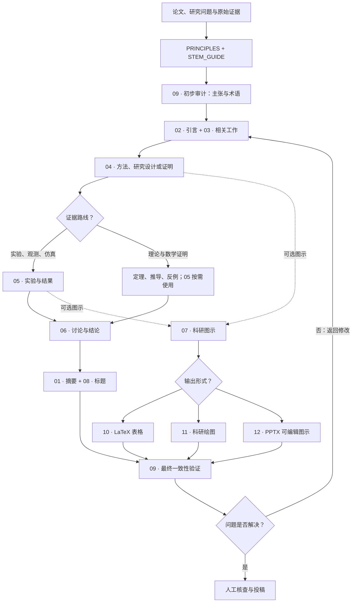

<div align="center">

# Paper StoryCraft

### 让审稿人读懂你的研究，而不是猜懂你的研究。

**13 个开源 AI Skills · 论文故事线重构 · 术语统一 · 图文协同 · 证据审查**

[](https://github.com/ChenXiangYpily1234/paper-storycraft-skills/stargazers)
[](LICENSE)
[](#13-个-skills一套完整工作流)
[](README_EN.md)

**简体中文** · [English](README_EN.md) · [总纲领 Principles](PRINCIPLES.md) · [理工科指南](STEM_GUIDE.md) · [完整工作流](WORKFLOW.md)

**[30 秒试用](#30-秒试用) · [看改写示例](#一个例子看懂它在做什么) · [选择 Skill](#13-个-skills一套完整工作流) · [⭐ Star 收藏](https://github.com/ChenXiangYpily1234/paper-storycraft-skills)**

</div>

---

> **论文不是实验日志，也不只是语言润色。**
>
> 真正重要的是让审稿人循序渐进地理解：**为什么这个问题值得研究？现有证据缺什么？你的方法为什么这样设计？实验究竟支持了什么？**

如果你的论文存在这些问题：

- 引言写了很多背景，却迟迟说不清 **研究问题和真正的 gap**。
- 方法介绍了一堆模块，但读者不知道 **为什么需要它们、它们怎样协作**。
- 缩写、符号、指标第一次出现时 **没有解释**，后面还换了名称。
- 实验和图表很多，读者却无法对应到 **具体研究主张**。
- 摘要、正文、图注和结论对 **同一概念或结果的表述不一致**。

**Paper StoryCraft** 就是为这类问题整理的一套可直接提供给 AI 写作/编程助手的科研论文修订指南。它不是“一键生成论文”，而是把已有研究组织成**读得懂、查得到证据、不过度宣称**的科学论证。

**一条主线：** 研究背景 → 科学问题 → 可核验的研究缺口 → 设计逻辑 → 方法/验证 → 证据 → 结论与边界。

**面向理工科（STEM）研究论文**：数学与理论、物理、化学、生物、地球与环境科学、材料、工程、计算机、数值仿真、实验研究、数据集与复现。**不扩展至人文、法律及非技术社会科学。** 不限会议、不设默认页数，不强制固定实验数量。详见 [理工科指南](STEM_GUIDE.md)。

## 一个例子，看懂它在做什么

以下是**虚构的写作示例**，仅展示叙事方法，不代表真实论文的科学结果。

| 常见写法 | StoryCraft 希望实现的表达 |
| --- | --- |
| “我们提出 MAF 模块，并取得显著提升。” | “当不同输入的信息质量变化时，固定融合权重可能不合适。为处理这一问题，我们采用**多阶段自适应融合（MAF）**：先估计各信息来源的可靠性，再据此调整融合权重。其作用需要通过受控实验检验。” |
| “实验结果证明我们的方法很好。” | “在**明确的数据、指标、对照和预算**下报告实际结果，再说明结果支持哪项主张，以及哪些解释仍未排除。” |
| 图里叫“Router”，正文叫“Controller”，表里叫“Policy”。 | 若三者确实指同一对象，选择一个**规范术语**并贯穿全文；若含义不同，首次出现时解释区别。 |

**这套 Skills 的核心不是把论文写得更夸张，而是减少审稿人的理解成本。**

## 30 秒试用

**无需先安装额外程序。** 如果你的 AI 助手可以读取 GitHub/本地文件，可以直接提供本仓库文件及你的论文材料；如果不能读取链接，先克隆或下载仓库，再让助手读取文件。

**① 获取仓库**

```bash
git clone https://github.com/ChenXiangYpily1234/paper-storycraft-skills.git
cd paper-storycraft-skills
```

**② 复制下面的提示词，让 AI 先诊断、再修改**

```text
请先阅读 paper-storycraft-skills/PRINCIPLES.md、
paper-storycraft-skills/WORKFLOW.md 和
paper-storycraft-skills/09-consistency-validation/SKILL.md。

结合我提供的论文、实验结果和引用材料，先做审稿人视角的诊断：
1. 用一句话概括研究问题、主要贡献和证据支持的结论。
2. 标记每处逻辑跳跃、研究 gap 不明确或段落衔接断裂的位置。
3. 找出首次出现却没有就近解释的术语、缩写和数学符号。
4. 建立全稿统一术语表，包含图、表、公式和图注。
5. 建立「主张—证据—适用边界」对应表，检查反例与竞争解释。
6. 按 P0/P1/P2/PASS 给出有位置、有理由的修改建议。

请先报告问题，不要直接改写整篇论文；
不得编造引用、实验、结果或创新点。
```

**③ 按诊断结果进入对应 Skill**

例如只想改引言：

```text
请读取 paper-storycraft-skills/PRINCIPLES.md 和
paper-storycraft-skills/02-introduction/SKILL.md，
重构我提供的 Introduction。确保问题逐步引出方法，
新术语首次出现就近解释，全文名称与实验保持一致。
保留真实事实、引用、数值和结论边界。
```

> **注意：** 本项目是 Markdown 指南集合，不是自动安装的插件；不同 AI 工具需要采用各自的文件访问/Skill 导入方式。核心 Skill 使用英文编写，**论文改写默认保留原稿语言**。

## Skills 工作流程图

理工科论文应根据主要证据选择**证明、实验、观测、仿真或工程验证**路径。流程为建议依赖关系，图表技能均按需使用。



详见 [完整工作流](WORKFLOW.md) 与 [STEM_GUIDE.md](STEM_GUIDE.md)。

## 13 个 Skills，一套完整工作流

| 模块 | Skill | 主要解决的问题 |
| --- | --- | --- |
| 论文叙事 | [01 · 摘要](01-abstract/SKILL.md) | 让问题、方法、证据和结论在摘要中闭环 |
| 论文叙事 | [02 · 引言](02-introduction/SKILL.md) | 从具体背景自然引出真实 gap 和方法动机 |
| 论文叙事 | [03 · 相关工作](03-related-work/SKILL.md) | 与最相关工作公平比较，而非罗列引用 |
| 论文叙事 | [04 · 方法](04-method/SKILL.md) | 先解释“为什么”，再讲设计、公式和数据流 |
| 论文叙事 | [05 · 实验](05-experiment/SKILL.md) | 每个实验回答一个问题，检查公平性与统计结论 |
| 论文叙事 | [06 · 讨论与结论](06-discussion-conclusion/SKILL.md) | 解释意义、替代解释、失败条件与适用边界 |
| 图表叙事 | [07 · 科研图示](07-figure/SKILL.md) | 让图承担清晰的科学论证职责 |
| 文字结构 | [08 · 标题与小标题](08-title-heading/SKILL.md) | 让标题成为论文论证逻辑的导航 |
| 质量审查 | [09 · 终稿一致性](09-consistency-validation/SKILL.md) | 审查术语、数据、引用、统计和图文冲突 |
| 图表工具 | [10 · LaTeX 表格](10-latex-table/SKILL.md) | 表格结构清晰、数字不失真、表注可理解 |
| 图表工具 | [11 · 科研绘图](11-research-plot/SKILL.md) | 根据真实数据制作可复现结果图 |
| 图表工具 | [12 · PPTX 可编辑图示](12-pptx-visual/SKILL.md) | 构建准确、可编辑且与正文一致的流程/架构图 |
| 章节重构 | [13 · 跨章节无损改写](13-section-revision/SKILL.md) | 防止公式与实验堆砌，保留既有 LaTeX 图表并重建论证链 |

### 为什么强调“总纲领”？

**[PRINCIPLES.md](PRINCIPLES.md)** 是 13 个 Skill 的共同约束：

1. **审稿人首次阅读能跟上：** 先给问题和直觉，再给专有概念与数学形式。
2. **新术语必须就近解释：** 首次出现的前一句、同一句或紧邻下一句必须让人知道“是什么、做什么、为何需要”。
3. **一词一义、全文统一：** 方法名、模块、指标、缩写、符号在正文、图表和附录中保持一致。
4. **主张必须有证据：** 实验、定理和引用支撑相应结论，明确前提与未能排除的解释。
5. **突出真正的研究价值：** 避免自我削弱式叙事，但不能隐藏重要负结果或夸大有效性。

## 新增：跨章节无损改写

如果“方法公式多、实验丰富，但论文像清单”，建议先使用 [13 · 跨章节无损改写](13-section-revision/SKILL.md)。它先建立**研究问题 → 正式判定 → 方法构造 → 直接证据 → 解释性实验 → 适用边界**的依赖关系（不是所有论文都必须按这个顺序），再重组过渡段和结果解释。

核心约束：**每个关键公式说明动机和后续用途，每张图表承担一个主要证据职责**。主性能、统计审计、组件消融和鲁棒性结果不可混称为同一种证据；组件消融通常也不能证明参照模型内部机制的因果必要性。

**无损改写指令：**

```text
请读取 PRINCIPLES.md、04-method/SKILL.md、05-experiment/SKILL.md、
09-consistency-validation/SKILL.md 和 13-section-revision/SKILL.md。
改写我论文的相邻章节，使公式、方法、实验形成连贯科学论证。
不删除或改变任何现有表格、图片、公式、数值、caption、label 和引用。
提供替换用 LaTeX、原始图表/公式保留清单、修改摘要及未验证事项。
未看过实验日志或编译 PDF 时，不得声称已验证可复现性或版式。
```


## 不知道从哪里开始？

| 你的当前问题 | 最适合先读 |
| --- | --- |
| “论文每段都能看懂，但连起来不像一个故事。” | [总纲领](PRINCIPLES.md) + [引言](02-introduction/SKILL.md) |
| “方法创新点被模块和公式淹没了。” | [方法](04-method/SKILL.md) + [标题](08-title-heading/SKILL.md) |
| “实验指标不少，却没有证明论文的关键主张。” | [实验](05-experiment/SKILL.md) + [一致性审查](09-consistency-validation/SKILL.md) |
| “图表美观，但解释不了它们回答什么问题。” | [科研图示](07-figure/SKILL.md) + [科研绘图](11-research-plot/SKILL.md) |
| “准备投稿，希望提前发现审稿人可能提出的疑问。” | [终稿审查](09-consistency-validation/SKILL.md) |

推荐阅读顺序：**全稿诊断 → 引言/相关工作 → 方法 → 实验/图表 → 摘要/标题 → 讨论/结论 → 全文审查**。根据论文类型调整，详见 [WORKFLOW.md](WORKFLOW.md)。

按这些指南执行时，建议要求 AI 输出：**故事线图谱、统一术语台账、主张—证据—边界表、改写稿、审稿人可能的疑问、P0/P1/P2/PASS 审查结果**。没有实际核验的项目不能标为 PASS。

## 如果它对你有用，欢迎点一个 Star

**Star 能帮助你以后快速找回项目，也能让更多正在改论文的研究者发现这套工具。**

[**⭐ Star Paper StoryCraft**](https://github.com/ChenXiangYpily1234/paper-storycraft-skills) · [提出建议或反馈问题](https://github.com/ChenXiangYpily1234/paper-storycraft-skills/issues)

如果你想参与改进，欢迎通过 Issue 分享可公开的学术写作问题、错误案例、适用学科或改进建议；避免上传未公开论文、个人信息或保密实验数据。欢迎贡献更通用的叙事检查规则和示例。

## 相关项目与致谢

推荐参考 [**anti-defensive-writing-en**](https://github.com/Adkid-Zephyr/anti-defensive-writing-Skill/blob/main/skills/anti-defensive-writing-en/SKILL.md)，来自 [Adkid-Zephyr/anti-defensive-writing-Skill](https://github.com/Adkid-Zephyr/anti-defensive-writing-Skill)。它关于突出真实优势、避免流水账和不必要自我贬低的思路具有参考价值；本仓库进一步要求**不得隐藏影响结论的重要负结果与局限**。二者是独立项目，未直接复制上游 Skill。见 [ACKNOWLEDGEMENTS.md](ACKNOWLEDGEMENTS.md)。

## 使用边界与许可证

本仓库不能代替真实实验、严谨的文献核验、人工审稿或最终 PDF 检查。示例与占位符**不代表真实研究结果**；表格和绘图工具需要使用实际可核验数据。第三方 PPTX 工具不包含在本仓库中。

本仓库原创内容采用 **[MIT License](LICENSE)**（Copyright © 2026 ChenXiangYpily1234），允许在保留许可与版权声明的条件下使用、修改和分发。被引用或链接的第三方项目仍遵守其各自许可证。

---

<div align="center">

**Make your research understandable. Make every claim defensible.**

[中文 README](README.md) · [English README](README_EN.md) · [开始阅读总纲领](PRINCIPLES.md)

</div>
