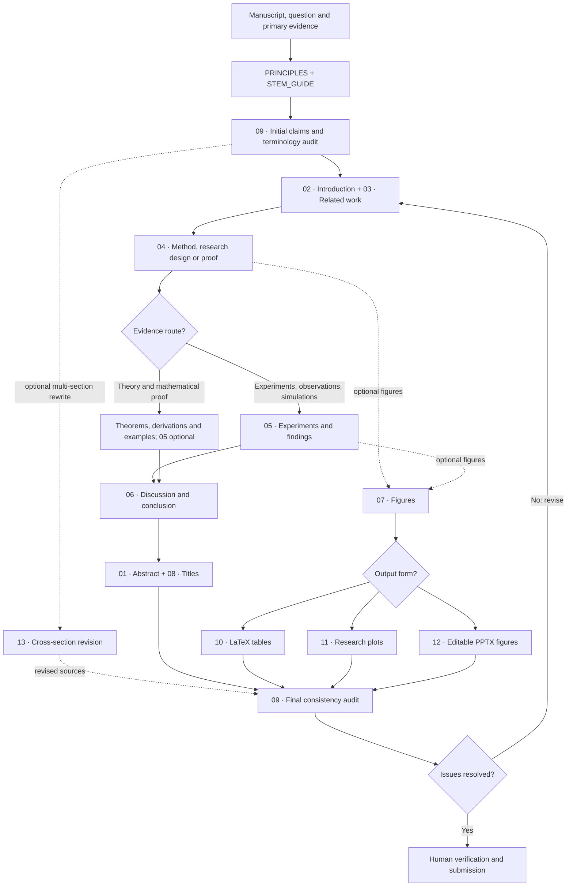

# Reviewer-First Research Storytelling Workflow

**Start with [PRINCIPLES.md](PRINCIPLES.md).** This workflow coordinates 13 independent Skills across STEM research, from proofs and experimental science to engineering and numerical methods. Read [STEM_GUIDE.md](STEM_GUIDE.md). It is a flexible dependency map, not a compulsory chapter order.

## Skills workflow diagram

The Mermaid graph depicts **editing dependencies**, not causal relations or mandatory chapter order. The `05-experiment` route is optional for proof-only manuscripts; visual tools are optional.

## Step 1 — Independently diagnose the scientific argument

Read the latest accessible manuscript, proofs or experimental records, measurement and calibration methods, simulations, bibliography, figures and evidence as relevant. Identify whether its contribution is mathematical, experimental, observational, numerical, engineering, empirical, or methodological.

Produce a one-paragraph scientific question; a verified gap; a concrete contribution; the strongest directly supporting evidence; and a claim–evidence–scope ledger with alternative explanations.

**Do not rewrite for persuasion before diagnosing unsupported claims.**

## Step 2 — Build a canonical terminology ledger

Record the central objects, terms, abbreviations, mathematical symbols, datasets, evaluation conditions, and metric definitions.

For each first meaningful occurrence, check whether the term is decipherable in the same sentence or immediately adjacent one. Include title, abstract, main text, formulas, figures, captions, tables, and appendices. Independent reading units require enough local explanation to stand alone.

When two phrases denote one concept, select one canonical term. When one phrase accidentally denotes different concepts, disambiguate the terms. Track actual manuscript locations.

## Step 3 — Rebuild structure before rewriting sentences

Suggested order, adaptable to paper type:

1. **02 Introduction + 03 Related Work:** derive the research question, closest comparisons, and real gap.
2. **04 Method:** present design requirements, actual operations or proof sequence, notation, and assumptions.
3. **05 Experiments (if applicable):** align each result or test with a claim; inspect controls, sampling, baselines, confounds and inference. For proof-only work, audit lemmas, assumptions and counterexamples instead.
4. **07 Figure + 10 Tables + 11 Plots + 12 PPTX (optional):** use only visuals that explain real operations, physical apparatus, proof relationships or evidence.
5. **01 Abstract + 08 Titles/Headings:** summarize stable scientific contributions without creating a promise the paper does not fulfill.
6. **06 Discussion/Conclusion:** interpret genuine evidence and explain boundaries, rival explanations, and implications.
7. **09 Consistency Validation:** independently audit citations, numbers, first-use explanations, cross-references, and final rendered layout.

For a theory paper, use the available lemmas and assumptions instead of pretending an empirical test is required.

## Optional: rewrite linked sections while retaining artifacts

For a request such as "rewrite Sections 3–5, preserving all tables and figures," invoke [13 Cross-Section Revision](13-section-revision/SKILL.md) with the Method, Experiment and Validation Skills. First inventory formulas, floats, captions, labels, image paths, citations and reported values. Then organize **scientific question → formal criterion → construction → direct evidence → explanatory controls → boundaries**, adapting roles to the actual paper.

Improve transitions and the distribution of explanation, not the source evidence. Produce a preservation manifest and separate status for source, PDF and raw-log checks. Do not claim successful LaTeX rendering without compiling and inspecting the target document.

## Step 4 — Conduct the blind reviewer read-through

Read in actual manuscript order, without hidden project notes. At every first-use technical term ask "What is this? What does it do? Why does it appear now?" At each paragraph transition ask "What question has the previous text left, and how does the next text answer it?"

At each table/figure inspect object, method, comparison scope, statistical unit, label meanings, legend and caption. Record blockers precisely; do not excuse them by noting that the author can explain later.

## Step 5 — Audit scientific defensibility and narrative strength

Use **clear, non-defensive phrasing** to emphasize the study's genuine contribution. A related reference is [anti-defensive-writing-en](https://github.com/Adkid-Zephyr/anti-defensive-writing-Skill/blob/main/skills/anti-defensive-writing-en/SKILL.md) by Adkid-Zephyr. Its framing is complementary, **not a license to conceal relevant negative outcomes or omit limitations**.

For each headline claim ask whether a credible simpler mechanism, stronger baseline, unequal resources, selective reporting, or alternative sampling process could explain it. Reduce claim strength if needed.

## Step 6 — Deliver and verify

Deliver an argument map, claim–evidence–scope ledger, canonical terminology ledger, first-use blockers, concrete revision plan, revised content in manuscript language, figure/text map, and P0/P1/P2/PASS findings.

Explicitly mark checks as **verified**, **unverified**, or **not performed**. Source-only review does not establish visual PDF correctness, and missing data cannot establish numerical claims.

### Reusable invocation

> Read `PRINCIPLES.md` and the relevant `SKILL.md`. Revise my paper from the perspective of an unfamiliar but competent reviewer. Derive each new section from what has already been established; define every unfamiliar term near its first use; use a canonical vocabulary consistently across body text, formulas, tables, and diagrams; trace claims to evidence and state material limits. Keep my actual scientific results, citations, and assumptions intact. Return a narrative diagnosis, terminology ledger, evidence map, recommended changes, and a P0/P1/P2/PASS audit. Do not impose a default venue or page limit.
